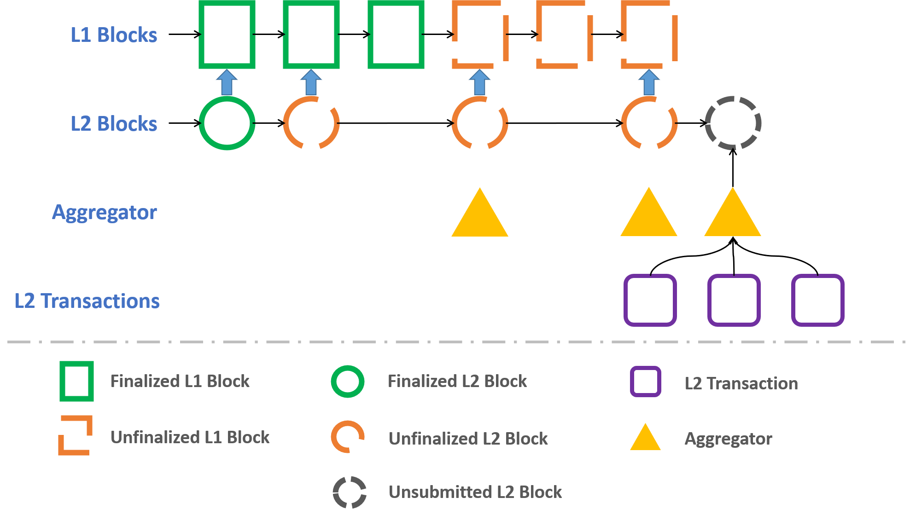

Life of a Godwoken Transaction
==============================

# Overview

Godwoken is a layer 2 rollup framework for [Nervos CKB](https://github.com/nervosnetwork/ckb). It provides scaling capability, as well as an account based programming model to CKB. Please refer to [this post](https://medium.com/nervosnetwork/towards-ckb-style-lego-pieces-polyjuice-on-godwoken-cbc935d77abf) for a general introduction on Godwoken. This post here dives into the internals of godwoken, explaining how godwoken works, and how each individual pieces are fit together.

# Rollup Layer 2 Chain

Fundamentally, Godwoken is a layer 2 solution for layer 1 Nervos CKB blockchain. [Here](https://explorer.nervos.org/aggron/address/ckt1qjd66s4u2xr3djsxahrwnmvkx94tl8j294klugw3ju2nv6h4krhc2t7ddtlvvtj44q4p7w4jlhfzyal5rlwlr9gakvqlxdkqrydv2h22ms4grg40q7w9656uvwk942srzsnep7f4hf5ncqg9pru2mkwv9ctsjp65tp) shows one deployment of Godwoken on CKB's testnet. A new layer 2 Godwoken block, packed in a layer 1 CKB transaction, is issued to CKB's network roughly every 90 seconds. Note the layer 2 block interval is a tunable parameter, which we will explain below. The current state of the layer 2 Godwoken blockchain is committed in the cell data part of a single CKB cell. [This layer 1 CKB transaction](https://explorer.nervos.org/aggron/transaction/0x51bee60d0e68bf3735dbaf7ffeea44727cd2112058a22b5a3e259810ce01a0de) serves as an example of the layer 2 Godwoken block. The chain state, as of this layer 2 block, is stored in the cell data part of the first output cell in this transaction:

```json
0xdab9fff9ede40ee4c4f77fea4af996e1b12cc0c4520e36eec11ecc0097a96baf33000000e1a06940a4a5f105ed0ef1c6d8bf5878c793aa62904bd1cb75431186587a57488b420000000000000000000000000000000000000000000000000000000000000000000000000000a23e00000000000000
```

This is actually a `GlobalState` data structure serialized in [molecule](https://github.com/nervosnetwork/molecule)'s format:

```
struct GlobalState {
    account: AccountMerkleState,
    block: BlockMerkleState,
    reverted_block_root: Byte32,
    last_finalized_block_number: Uint64,
    // 0: running, 1: halting
    status: byte,
}
```

Please refer to [this file](https://github.com/nervosnetwork/godwoken/blob/7a9d0e594e2fe80ea9bd4b7c013dc705f4e9f05d/crates/types/schemas/godwoken.mol#L18) for more definitions.

The actual layer 2 Godwoken block, is also contained in the layer 1 CKB transaction. The first witness of the above mentioned transaction, contains the following data:

```
0x2c02000010000000100000001000000018020000180200002000000018010000590100005d010000610100006501000014020000f8000000240000002c0000003000000050000000580000007c000000a0000000d80000008a42000000000000000000000000000000000000000000000000000000000000000000000000000000000000e1870e6000000000dab9fff9ede40ee4c4f77fea4af996e1b12cc0c4520e36eec11ecc0097a96baf33000000dab9fff9ede40ee4c4f77fea4af996e1b12cc0c4520e36eec11ecc0097a96baf33000000380000001000000030000000340000000000000000000000000000000000000000000000000000000000000000000000000000000000000000000000000000000000000000000000000000000000000000000000000000000000000000000000000000000000000000000000000000000000000000000000000000000000000000000000000000000000000000000000000000000000000000040000000000000004000000ab0000004c50015a173879f96ed3d518764255849a34282b3b00326848c7e9e5c4b70dee4e34b750030db70edcd84c516ebe6b9e2b8c37f93001a740e20305f061147b91f5e8b078e85007e8deaaae54dc3d560e4da736fd8ac06d6b1e60d98fa6ee475524a63ca1b3b9aa5009d719c2db9dd31513c5d0a3cd22012400b55bb2fe91bf347c378ba4ac7379fc52500e1ca9d7c1150f156443c30a3581721d99915d6318c57b6af459aae3781e92147800000000
```

This is actually a `WitnessArgs` data structure described [here](https://github.com/nervosnetwork/godwoken/blob/7a9d0e594e2fe80ea9bd4b7c013dc705f4e9f05d/crates/types/schemas/blockchain.mol#L105), and serialized in [molecule](https://github.com/nervosnetwork/molecule)'s format. In the `output_type` field of WitnessArgs, the actual `L2Block` data structure is stored, also serialized in molecule's format:

```
table L2Block {
    raw: RawL2Block,
    signature: Signature,
    kv_state: KVPairVec,
    kv_state_proof: Bytes,
    transactions: L2TransactionVec,
    block_proof: Bytes,
    withdrawal_requests: WithdrawalRequestVec,
}
```

Also, please refer to [this file](https://github.com/nervosnetwork/godwoken/blob/7a9d0e594e2fe80ea9bd4b7c013dc705f4e9f05d/crates/types/schemas/godwoken.mol#L52) for more definitions.

The output cell containing the `GlobalState`, is named **rollup cell**, since this cell contains all the latest information for a particular Godwoken rollup deployment. Careful readers here might notice that Godwoken has no restrictions on how many rollup cells are permitted in CKB, which is correct. Multiple Godwoken deployments can be setup in a single CKB blockchain for different purposes. Each Godwoken deployment, is thus identified by the rollup cell.

Godwoken requires the rollup cell for each Godwoken deployments to use a particular Godwoken type script, named **state validator** script. This script will perform the following duties:

* Enforce [type ID](https://xuejie.space/2020_02_03_introduction_to_ckb_script_programming_type_id/) logic, this gives each rollup cell an ID, so one won't need to refer to rollup cell's [OutPoint](https://docs.nervos.org/docs/basics/glossary#outpoint), which is changed whenever the rollup cell is updated. The [type script hash](https://docs.nervos.org/docs/basics/glossary#type-script-hash) of the rollup cell, is also named **rollup type hash** of current Godwoken deployment. Rollup type hash can also be viewed as a chain ID, uniquely identifying each layer 2 Godwoken blockchain.
* Enforce Godwoken's own checking logic. The state validator type script ensures that the `GlobalState` is indeed calculated from the current L2 block. (**TODO**: state validator validation rules).

State validator type script is the backbone of Godwoken, it ensures all the security checks are performed on chain, and all the layer 2 funds stay secure in a decentralized environment.

## Storage

Godwoken provides an account model to Nervos CKB:

* A giant 256-bit keyspace storage is provided to applications running on Godwoken.
* Conceptually, Godwoken provides a sequential model: each layer 2 transaction is applied to the Godwoken storage in sequence. Smart contracts in layer 2 transactions are free to read from and write into the storage space.

One might wonder where all the data are stored given constant storage requirement in the above transactions. Godwoken leverages [Sparse Merkle Tree](https://medium.com/@kelvinfichter/whats-a-sparse-merkle-tree-acda70aeb837) to build the storage space. Only the root hash of the Sparse Merkle Tree(SMT) is kept in the rollup cell. State validator validates that the sparse merkle tree is correctly updated in each layer 2 block. We actually took a step further here, and build an optimized SMT, which can save a lot of space and calculation for CKB's use case. Please refer to [here](https://github.com/jjyr/sparse-merkle-tree) for more details.

## Optimistic Rollup

Godwoken by design, only defines a generic rollup framework. Both optimistic rollup and zero knowledge rollup can be supported by Godwoken. However, in the current version, we are primarily focusing on optimistic rollup. The following workflow is used by Godwoken:



* Individual parties, named *aggregators* can collect layer 2 Godwoken transactions(more details on layer 2 transactions will be explained below), then pack them into layer 2 blocks, and submit them to CKB. Due to the nature of optimistic rollup, aggregators will need to stake a certain amount of CKB in order to submit a layer 2 block.
* Each layer 2 block submitted to the chain is first marked as **unfinalized**. An unfinalized layer 2 block might be challenged by others(named **challengers**), if the layer 2 block appears malicious.
   + A challenger starts a challenge request by marking one layer 2 transaction in the layer 2 block as invalid. Some CKB will need to be staked in order to create a challenge. Once a challenge request is included in CKB, the challenge phase is started.
   + In a challenge phase(details will be explained below), the original aggregator submitting the block will need to prove that the marked layer 2 transaction is indeed correct. The aggregator can do this by submitting a cancel challenge request, which executes the marked layer 2 transaction on chain. CKB only accepts valid transaction on chain, which means the layer 2 transaction must succeed for the cancel challenge request to be committed on chain. In a cancel challenge request, aggregator can claim staked tokens from the challenger.
   + If an aggregator fails to prove the validity of the layer 2 transaction via a cancel challenge request, the challenger can claim tokens staked by the aggregator, and revert the chain to the state just before the invalid layer 2 block.
* After a certain amount of time, an unfinalized layer 2 block will become finalized. Finalized layer 2 blocks will be freezed, and cannot be challenged by anyone.

Note this is slightly different from a typical optimistic rollup: here a transaction is executed, only to prove the transaction is valid, while a timeout indicates challenge success in this case.

In this design, an aggregator offers liquidity costs for staking CKBs used in submitting layer 2 block, as well as layer 1 transaction fees used in the layer 1 transactions containing layer 2 block. In exchange, the aggregator can charge layer 2 transaction fees from layer 2 users. As explained below, layer 2 transaction fees can be paid either in CKB or in any kind of [sUDT](https://github.com/nervosnetwork/rfcs/blob/master/rfcs/0025-simple-udt/0025-simple-udt.md). In fact, Godwoken treat CKB and sUDTs as exactly the same thing in layer 2.

## PoA Deployments

Godwoken is designed based on the assumption that anyone shall be able to issue layer 2 blocks. However, in reality, this might not be feasible for different cases: a public layer 2 blockchain will have additional requirements, that blocks must only be issued at certain intervals to prevent congestions; a private layer 2 blockchain might be only issued by certain parties.

This is the reason why Godwoken only uses the type script in a rollup cell. The lock script is thus left to each individual Godwoken deployments, so they can determine the best solution for themselves. Requirements for some might be obstacles for others. As a starting point, and an inspiration for more solutions, a [Proof-of-Authority](https://en.wikipedia.org/wiki/Proof_of_authority) lock script is [provided](https://github.com/xxuejie/clerkb) in current Godwoken deployment. The PoA lock script works as follows:

* An existing cell is setup as `PoASetup` cell. See output cell #1 in this [transaction](https://explorer.nervos.org/aggron/transaction/0xf9e630d22d1377b872628a02d352f4ecd8d5b1ee690783017b0194cbc2f57124) for an example, the cell data part for this output cell is as follows:

    ```
    0x012002025a000000010000003b472f23a03429f7eb7c1c1303f80bf4121493ec5442af22077699cd91e01cb0cbe87b9352103850ac8725a2b094f8732188a6b6e292abef6ef2342216980372
    ```

    This contains the [PoASetup](https://github.com/xxuejie/clerkb/blob/f5455b1bbc3155fdd0e4dd96cf0667cc22098a8b/src/config.ts#L7) data structure in a [customized](https://github.com/xxuejie/clerkb/blob/f5455b1bbc3155fdd0e4dd96cf0667cc22098a8b/src/config.ts#L68) serialization format.
* Apart from aggregator identities, a PoASetup data structure also contains information defining **round internal**. Each aggregator gets its round internal in terms. In a round interval, an aggregator can submit up to a pre-defined number of new layer 2 blocks. A round internal is either determined by on-chain timestamps, or block numbers.
    In the above example, the PoASetup includes 2 aggregators, each aggregator gets a round interval of 90 seconds, where it can issue at most one layer 2 block.
* In an actual transaction unlocking the PoA guarded cell, a different cell named `PoAData` cell must also be updated with PoA information. In the current Godwoken deployment, each transaction contains such `PoAData` cell, an example can be found in output cell #1 of this Godwoken [transaction](https://explorer.nervos.org/aggron/transaction/0x51bee60d0e68bf3735dbaf7ffeea44727cd2112058a22b5a3e259810ce01a0de). The data part for this output cell is:

    ```
    0xa3860e6000000000a3860e6000000000000000000000
    ````

    This contains the [PoAData](https://github.com/xxuejie/clerkb/blob/f5455b1bbc3155fdd0e4dd96cf0667cc22098a8b/src/config.ts#L16) data structure in a [customized](https://github.com/xxuejie/clerkb/blob/f5455b1bbc3155fdd0e4dd96cf0667cc22098a8b/src/config.ts#L120) serialization format. The PoA lock script uses PoAData cell to update round internal information, such as starting point of current round interval, and progress in current round interval.
* The identity of each aggregator is proved using the same [owner lock technique](https://github.com/nervosnetwork/rfcs/blob/master/rfcs/0025-simple-udt/0025-simple-udt.md#owner-lock-script) as used in sUDT: the aggregator include a special input cell in the current transaction, the input cell's lock script hash must match the identity included in the PoASetup cell.
* The aggregators can also start a vote to update the contents in the PoASetup cell. For example, when an aggregator behaves badly, either by not issuing blocks, or issuing too many invalid blocks, the other aggregators can start a vote to upgrade the PoASetup cell, hence removing the misbehaved aggregator. Another example here, is that in the event of congested network, aggregators can vote to alter the round intervals for better performance.

# Actions

In this sections we will explain all the actions one can perform on Godwoken, together with technical details related to each action.

## Deposit

To use Godwoken, one must first deposit some tokens(either CKB or sUDTs) from layer 1 to layer 2. This is named as a **deposit** action. A deposit action is represented as a layer 1 CKB transaction, it must create a special output cell named a **deposition cell**. [Here](https://explorer.nervos.org/aggron/transaction/0x09334d0ab2bf84714f0e51715bb7251a4887aa3066ef5ad0770bd463297c1194) is an example of a deposit action. This transaction deposits 10000 CKB to Godwoken. What is relavant here, is the lock script of output cell #0:

```
{
    "code_hash": "0xf412b31445c378d8778b545d81d13d39d3344de7f7e8bd7b18b103a5b13edc6b",
    "args": "0x4fb03f323f32196cce0232d1398b6eba4e36654eb431b8c71aa45b745dbb1e0a8100000010000000300000007900000010291f3d4de6bbd924e2a6a0b5dbe96654540dc789a901c0b8826ae0f7786ea249000000100000003000000031000000000000000000000000000000000000000000000000000000000000000000000100140000009c11877e58c9822131ef09744856fd6b9ce2fa9e00a30200000000c0",
    "hash_type": "type"
}
```

`code_hash` and `hash_type` used here is pre-determined by each Godwoken deployment. `args` here contains 2 parts: the first 32 bytes of `args`, contain the **rollup type hash** of the current Godwoken deployment(remember we mentioned earlier, that rollup type hash works like a chain ID?). The remaining part, is the [DepositionLockArgs](https://github.com/nervosnetwork/godwoken/blob/v0.1.0/crates/types/schemas/godwoken.mol#L121) data structure, serialized in molecule format:

```
table DepositionLockArgs {
    // layer1 lock hash
    owner_lock_hash: Byte32,
    layer2_lock: Script,
    cancel_timeout: Uint64,
}
```

This data structure contains 2 parts of information:

* `layer2_lock` specifies the lock script to use, when Godwoken transfers the tokens to layer 2.
* `owner_lock_hash` and `cancel_timeout` provide a way to redeem the token in the case Godwoken ignores this request(e.g., when the network becomes bloated). `cancel_timeout` specifies a timeout parameter in CKB's [since](https://github.com/nervosnetwork/rfcs/blob/master/rfcs/0017-tx-valid-since/0017-tx-valid-since.md) format. When the timeout has reached, the user can create another request to cancel the deposit action, and redeem his/her tokens for other use. `owner_lock_hash` is used to provide the token owner's identity in case of a cancel deposit action.

Godwoken will periodically collect all live deposition cells, and include them in layer 2 blocks. Each deposition cell will be transformed to **custodian cell** by Godwoken, correspondingly, Godwoken will create(if one does not exist) a layer 2 account based on the `layer2_lock` used in `DepositionLockArgs`, then put the newly deposited tokens inside this account.

Custodian cells contain all the tokens that are managed internally in Godwoken. This [transaction](https://explorer.nervos.org/aggron/transaction/0x05fb7fb33b092272a4e259688e21bd1c78320bda641b062a755af9ec2849223c) contains a custodian cell in its output cell #2. Like a deposition cell, a custodian cell is represented by its lock script:

```
{
    "code_hash": "0x3c5551b6cce4d6873a636684f26fae173be653bf2122997b7023acad63a9fff1",
    "args": "0x4fb03f323f32196cce0232d1398b6eba4e36654eb431b8c71aa45b745dbb1e0ab90000001000000091000000b10000008100000010000000300000007900000010291f3d4de6bbd924e2a6a0b5dbe96654540dc789a901c0b8826ae0f7786ea249000000100000003000000031000000000000000000000000000000000000000000000000000000000000000000000100140000009c11877e58c9822131ef09744856fd6b9ce2fa9e00a30200000000c05d5d69e73faa984f8619646fcf9aa971c72978604e191dab99d2d8588b68a6b13301000000000000",
    "hash_type": "type"
}
```

Like deposition cells, custodian cells have pre-determined `code_hash` and `hash_type` based on Godwoken deployments. The first 32 bytes in `args` contain the rollup type hash as well. What's different here, is that [CustodianLockArgs](https://github.com/nervosnetwork/godwoken/blob/v0.1.0/crates/types/schemas/godwoken.mol#L131) is used instead to fill the remaining part of `args`:

```
table CustodianLockArgs {
    // used for revert this cell to deposition request cell
    // after finalize, this lock is meaningless
    deposition_lock_args: DepositionLockArgs,
    deposition_block_hash: Byte32,
    deposition_block_number: Uint64,
}
```

As noted, custodian cell contains the original deposition information, as well the layer 2 block info in which the original deposition cell is processed.

**TODO**: cancel deposit action with examples.

## Layer 2 Transfer

Once tokens have been deposited and processed by Godwoken, they can be used in layer 2 Godwoken blockchain. A layer 2 Godwoken transaction uses totally different structure from a layer 1 CKB transaction:

```
table RawL2Transaction {
    from_id: Uint32,
    to_id: Uint32,
    nonce: Uint32,
    args: Bytes,
}

table L2Transaction {
    raw: RawL2Transaction,
    signature: Signature,
}
```

Please refer to [this file](https://github.com/nervosnetwork/godwoken/blob/v0.1.0/crates/types/schemas/godwoken.mol#L27-L37) for a more complete definition and related types.

For those of you who are already familiar with CKB's transaction structure, this might actually surprise you. While the signature part might ring a bell, there are no cells in this transaction structure, there are only 32-bit integers value representing accounts, 32-bit nonce which is not used in layer 1 CKB, as well as a single variable length `args` part. But there is no need to panic! We will explain the details on this layer 2 transaction structure piece by piece.

While all operations on layer 2 Godwoken can be represented as a `L2Transaction` in the above format, let's start from a simple transferring operation:

**TODO**: add transferring example

### Account Lock

Account lock controls how a signature for a layer 2 transaction is validated. Recall that a deposition cell actually includes a layer 2 lock script in its `DepositionLockArgs`:

```
table DepositionLockArgs {
    layer2_lock: Script,

    // ...
    // other fields are omitted
}
```

When Godwoken sees a `layer2_lock` in a `DepositionLockArgs` data structure, it first queries its internal storage to locate an account using the particular layer 2 lock script. If there is not one, Godwoken will create a new account for this lock script, and assign an associated 32-bit integer account ID. Note that Godwoken enforces one-to-one mapping between layer 2 lock script, and account ID:

* Given an account ID, one can look up for the layer 2 lock script in Godwoken
* Given a layer 2 lock script, there can be at most one account ID using that lock script in current Godwoken deployment

This provides some handy consequences for us:

* A user does not have to remember his/her account ID in a Godwoken deployment. One can only remember his/her wallet address, which can be used to query the correct account ID when translated to layer 2 lock script;
* A layer 2 transaction can only include the account ID, which can be used to query the actual layer 2 lock script to use. This results in smaller layer 2 transaction and bigger throughput.

Now we can have some harmony here: a user can pick any lock script to use in layer 2, while still minimizing layer 2 transaction size. The advantage here, is that we can preserve the same flexibility in layer 1 CKB as well in layer 2 Godwoken: one can freely pick any lock script to use.

This actually have greater usage here: some of you might already know that we build godwoken together with polyjuice, our Ethereum compatible solution. Naturally, we have an Ethereum compatible lock, that enables you to use [Metamask](https://metamask.io/) together with polyjuice. But the story does not stop here: with a different layer 2 lock that implements, for example, EOS signature validation logic, an EOS wallet can also be empowered to call Ethereum dapps with polyjuice. The whole interoperability power of Nervos CKB, is perserved in Godwoken as well.

Now we can derive the signature validation rule for a layer 2 Godwoken transaction:

* Using `from_id` in the layer 2 transaction, Godwoken locates the corresponding layer 2 lock script
* The layer 2 lock script is executed to validate the layer 2 transaction

There is one quirk to the above flow here: recall that current Godwoken uses optimistic rollup design. Due to the "optimistic" nature, the layer 2 lock script is not typically executed on chain. It is only executed in the case that a challenger starts a challenge request on chain, and an aggregator proves the validity of the layer 2 transaction via a cancel challenge request. Hence the way to build a layer 2 lock script, is also slightly different here. An example for such a script, can be found [here](https://github.com/nervosnetwork/godwoken/blob/93c161b7dddbf517763f6d653f1f53630914a8eb/c/account_locks/eth_account_lock.c).

### Backend

With signature validated, another problem arises: how does Godwoken compute the next on-chain state? **Backends** in Godwoken handles this task.

Godwoken actually has 2 kinds of accounts:

* Typical user accounts denoted by an account lock
* Contract accounts denoted by a backend script

Ethereum developers would recognize that this design resembles a lot like EOA vs contract account in Ethereum, which is true since Godwoken is inspired from Ethereum here.

While a typical user account provides ownership for a user, contract account, on the other hand, provides a storage space for an on-chain smart contract. Similar to the way that a user account is created from a general lock script with a user's public key hash, a smart contract for a contract account is created from a **backend** with some special script args. The smart contract is also represented using the unified [Script](https://github.com/nervosnetwork/godwoken/blob/v0.1.0/crates/types/schemas/godwoken.mol#L27-L37) data structure in the Nervos ecosystem: the combination of `code_hash` and `hash_type` in a script identifies the backend, while `args` provide contract account specific arguments.

With enough background, the rule for executing backends can be introduced:

* Using `to_id` in the layer 2 transaction, Godwoken locates the corresponding backend script
* The backend script is executed to calculate the state after applying current transaction.

Similar to account locks, the above rule is more of a conceptual rule. The actual backend script is only executed on-chain in a cancel challenge request.

As examples, several different backends will be introduced here:

#### sUDT

sUDT is the most commonly used backend in Godwoken. All tokens, whether they are CKB or layer 1 sUDTs, will be represented as a layer 2 sUDT type in Godwoken. A layer 2 sUDT backend script is defined via the following specification:

* `code_hash` and `hash_type` are pre-determined by each Godwoken deployment
* `args` contains the script hash of layer 1 sUDT type script. In case CKB is used, `args` will be `0x0000000000000000000000000000000000000000000000000000000000000000`.

This way we can correlate layer 1 sUDT type script, with its corresponding layer 2 sUDT backend script.

The layer 2 sUDT backend provides [ERC20](https://eips.ethereum.org/EIPS/eip-20) compatible interface, even though you are not using Solidity and EVM, a similar API will be available for you to use.

Notice sUDT contract account is typically created by Godwoken automatically when processing deposition cells. One don't typically create new contract account using sUDT as backend script.

An implementation for the layer 2 sUDT backend can be found [here](https://github.com/nervosnetwork/godwoken/blob/v0.1.0/c/contracts/sudt.c).

#### MetaContract

MetaContract is a special backend in Godwoken:

* It is reserved as account ID 0
* You cannot create a new contract account using MetaContract as the backend

The sole purpose of MetaContract now, is to create contract account given a particular backend.

**TODO**: create polyjuice root account

#### Polyjuice

Polyjuice is the main backend we use now in Godwoken. It allows us to create a contract account using EVM bytecode, the resulting account, will be able to execute smart contracts written for Ethereum. Polyjuice aims at 100% compatibility in EVM level, meaning all programs runnable on Ethereum, can be run on Godwoken powered by Polyjuice.

For more details on polyjuice, please refer to Life of a Polyjuice Transaction(**TODO**: add link when the document is ready).

### Managing Account Locks & Backends

While one is free to create as many accounts as possible, Godwoken now only supports whitelisted account locks & backends for a security reasons. The list now include:

* Ethereum compatible account lock
* Layer 2 sUDT backend
* Polyjuice backend

If there is one particular account lock or backend you like, please do not hesistate to let us know. We are interested in a future where an EOS wallet can control an Ethereum app, or a BTC wallet can control a [Diem](https://www.diem.com/en-us/) app. Those are all feasible on Godwoken with the composability of account locks, and backends.

## Withdraw

**Withdraw** action enables one to withdraw tokens from layer 2 Godwoken back to layer 1 CKB. A withdraw action uses the following data structure:

```
struct RawWithdrawalRequest {
    nonce: Uint32,
    capacity: Uint64,
    amount: Uint128,
    sudt_script_hash: Byte32,
    account_script_hash: Byte32,
    sell_amount: Uint128,
    sell_capacity: Uint64,
    owner_lock_hash: Byte32,
    payment_lock_hash: Byte32,
}

vector WithdrawalRequestVec <WithdrawalRequest>;

struct WithdrawalRequest {
    raw: RawWithdrawalRequest,
    signature: Signature,
}
```

Please refer to [this file](https://github.com/nervosnetwork/godwoken/blob/v0.1.0/crates/types/schemas/godwoken.mol#L71-L94) for a more complete definition and related types.

A `WithdrawalRequest` uses `account_script_hash` as a key to locate the account lock, perform the same signature verification flow as layer 2 transaction. Withdraw action can be used to withdraw CKB and a layer 1 sUDT type simutaneously. Due to CKB's cell model limitation, Godwoken requires each withdraw request to withdraw at least 400 CKB.

You might notice more fields are included in `WithdrawalRequest`, those are used to fulfill a special feature of Godwoken: selling of withdrawed tokens. This is explained in the next section.

### Sell withdrawed Tokens

**TODO**: introduce withdraw token selling

### Unlock Withdrawed Cells

**TODO**: provide unlock withdrawed cell example

## Challenge

**TODO**: provide challenge example
