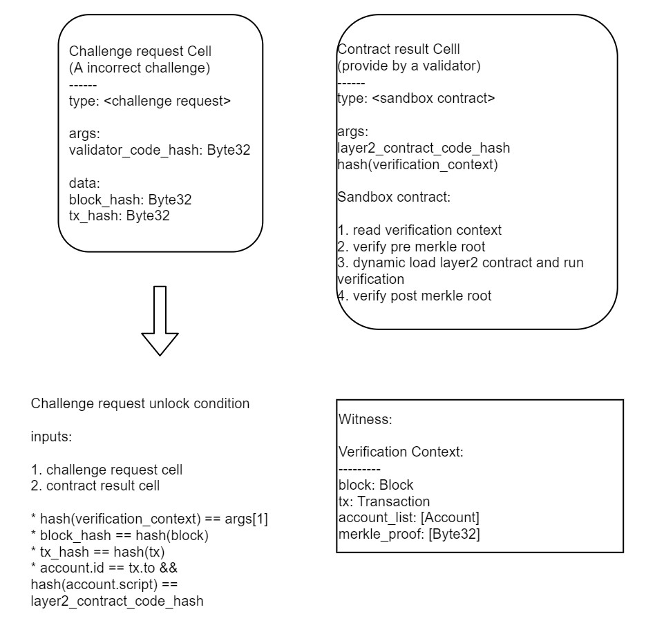

# Optimistic Rollup

## Architecture

Godwoken composited by the following parts:

### On-chain

type scripts:

* State validator - a type script validates the global state of all accounts and all layer2 blocks in Rollup.
* Challenge validator - a type script that handles challenge requests.

lock scripts:

* Always success lock - a lock script that always returns success; this script is the lock of Rollup cell
* Custodian lock - lock of rollup custodian assets; this script only be unlocked in a transaction that contains the Rollup cell
* Deposition lock - the lock used for deposition; which can be unlocked in a transaction that contains the Rollup cell or be withdrawn by the sender with a signature

### Off-chain

* Aggregator - an off-chain program that regularly collects layer2 transactions and submits layer2 blocks to the State validator.
* Validator - an off-chain program that continuously watches the two contracts. The validator sends a challenge request to contracts when an invalid state is submitted.

Typically, an aggregator is also a validator.

### Terms

* Rollup cell - rollup on-chain state, contains global state: `block_root` and `account_root`, use `state validator` as its type, aggregators submit new on-chain state by consuming this cell and produce a new cell with the same type_hash.
* Rollup_type_hash - rollup cell's type_hash, which is a unique value for each rollup.

## Layer2 structures

### Account

The following fields construct an account `(id: u32, nonce: u32, code: Script)`:

- id, the unique id of the account
- nonce, an increment nonce
- code, compatible with CKB Script structure
  - code_hash, blake2b hash of the contract code, for an EOA(external owned account) the code_hash reference to a unlock contract
  - args, initial args for the contract, used to distinguish different contracts
  - script_hash_type, always equals to data
- *address, a unique virtual field calculated by blake2b(code); the creation will fail if the address is a collision with an existing one.

States of accounts are all accumulated in the global merkle tree, so we don't have a per account `state_root`.

> Currently, the unlock contracts used in an EOA are in a trust list. The operator of a rollup may define its own unlock contracts and extend the trust list.

## Layer2 assets representation

To participant in the nervos network economy, we must transfer assets between layer1 and layer2.

The basic idea is to write an equivalent contract on layer2 to receive layer1 assets.

So we design a Simple UDT equivalent contract on layer2. When a new deposition of SUDT happened on layer1, Godwoken creates a new equivalent layer2 SUDT contract to receives these tokens.

Since the Godwoken keep account address(`hash(code)`) unique, the layer2 SUDT is naturally unique for each type of token. 

Any user and wallet must query the layer2 SUDT account_id before sent tokens.

We provide basic APIs to support query balance and transfer token:

* query(account_id) -> value
* transfer(to, value, fee)
* token_id() -> Byte32

A layer2 user is supposed to use these APIs to query and transfer tokens. For simplicity, we also treat the CKB as a SUDT token that token_id is all zero: `0x0000...0000`.

### Mint & Burn

When a new user deposits assets to join to layer2, we mint new tokens to the user's SUDT account.
When a user withdraws assets and leaves layer2, we burn equivalent tokens from the user's SUDT account.

Aggregators operate Mint & Burn by directly modify the account state tree, and the state-validator contract ensure the state is valid.

## Builtin accounts

There are several builtin accounts in the Godwoken:

* `RESERVED_ACCOUNT: 0` - the zero id account is reserved for special use, for example, transfer to 0 to burn tokens or send a transaction to 0 to create new contracts.
* `CKB_SUDT_ACCOUNT: 1` - the CKB simple UDT contract.

## State validator

State validator is the main contract to validate our Rollup. We use a cell to represent the state of Rollup, which we called global state in this documentation:

`(account: MerkleRoot, block: MerkleRoot, status: u8)`

The `account` and `block` represent the roots of sparse merkle trees. `account` stores all the layer2 accounts, and `block` stores all layer2 blocks. The `status` represents the Rollup contract's status.

We define the following status:

* running
* reverting
* halting

Most time, our contract status is `running`. When a challenging success, the challenger needs to rever the chain and change Rollup's status to `reverting`. Then, after reverting the chain, change the Rollup's status to `running` again. But in failed situations, no one successfully challenges a bad block during the challenge period. The reverting of the chain will fail because the attacker already withdraws stolen assets to the layer1. In this situation, the Rollup's status will become `halting` and stop accepting most operations. We will design a recovery mechanism for failure.

Godwoken contract supports several operations to update the Rollup cell:

* Create account
* Deposit
* Submit block
* Revert block
* Prepare_withdraw
* Withdraw

## Join & Leave

### Join rollup (Deposit)

To join a layer2 Rollup, users need to create deposition request cells on-chain.

``` sh
Cell {
  lock: Script {
    code_hash: <deposition_lock>
    hash_type: <...>
    args: <rollup_script_hash|code_hash|args>
  }
  capacity: <capacity>
  data: <empty or valid UDT data>
  type_: <none or an valid UDT type>
}
```

Users put CKB or UDTs into deposition request cells, then wait for aggregators to collect them.

The lock script `deposition_lock` allows two unlock conditions:

1. The owner unlocks this cell by putting an extra input cell in the same transaction; the lock script returns success if `input_cell.lock.script_hash_type` equals to `data`, and `input_cell.lock.code_hash == lock.args.code_hash && input_cell.lock.args == lock.args.args`.
2. An off-chain aggregator unlocks this cell by putting it in the same transaction that updates the Rollup's global state; the lock script checks input cells and returns success of one input cell's type matches `rollup_script_hash`.

The deposition cells are transferred under custodian lock after submitted to layer1, and the status of coins is accumulated into the global state.

### Leave rollup (Withdraw)

Users need two steps to withdraw assets back to layer1:

1. Prepare withdrawal: send a tx to burn X tokens from the SUDT contract
2. Withdrawal: after the `WITHDRAW_TIMEOUT` blocks, the user can withdraw X tokens back to layer1.

The `WITHDRAW_TIMEOUT` is a u64 number representing the number of blocks that users must be waiting for.

Let's see the details of the withdrawal process.

Users firstly send a layer2 transaction `(from: user's id, to: SUDT id, nonce, args: amount to withdraw)` to the aggregator to move layer2 token into a withdraw queue, the SUDT contract record the withdrawal as：`(block_number, amount)`.

After `WITHDRAW_TIMEOUT` blocks after the prepare withdrawal transaction has been submitted. User send a withdraw request to aggregator via RPC `(acp_lock_hash, sudt_id, amount, account_id)`, the aggregator removes the withdrawal request from the SUDT contract and moves the layer1 custodian asset to the user's [anyone-can-pay](https://github.com/nervosnetwork/rfcs/blob/master/rfcs/0026-anyone-can-pay/0026-anyone-can-pay.md) cell.

> The timeout parameter WITHDRAW_TIMEOUT defines an upper bound of the challenge period; after the timeout, if we still can't prevent a malicious user from withdrawing assets to layer1, the rollup state is corrupt.

### Revert invalid blocks

Godwoken uses the optimistic mechanism, which means a malicious aggregator may commit an invalid block to the rollup contract. When this happens, we expect a validator to send a challenge and revert the Rollup status.

To simplify the design, the Godwoken uses a standalone contract to challenge; thus, the contract generates a proof cell. The state-validator verifies the proof cell and starting to revert the layer2 chain.

We take a look at the process of reverting. Firstly, we define a security assumption: after an attacker submits a bad block to the Rollup, during the `WITHDRAW_TIMEOUT` blocks, there always a validator can successfully challenge the invalid block and start the reverting process. We would talk about what happens if our security assumption failed later.

We assume a bad block B is on the Rollup, and we already get a challenging proof cell. A validator can then send a revert request: `(B.number, challenge proof cell)` to the state validator contract. The state validator verifies the challenge proof cell and set the rollup status to `reverting`, create an extra revert cursor `last_valid_number = B.number - 1` in the Rollup cell, and update the global state `global_state.account = last_valid_block.post_account`.

In the `reverting` status, the Rollup can't do anything other than continue to revert the rollup chain; to continue the reverting process, we need to resubmit layer2 blocks from the `last_valid_number + 1` to the `tip`, which is the last block of the Rollup. We do this because a block may process a deposition request after the bad block B, so if we simply revert all account state the depositor won't get the money, we must replay the deposition request to mint tokens for the depositor.

> Notice the deposition is safe to replay on the Rollup because a deposition moves layer1 assets to layer2.

And a question comes up, how can we replay a withdrawal request? If a user withdraws the assets to layer1, we can't get it back to layer2, so we must update the rollup state correctly to reflect the withdrawal. Notice the SUDT contract maintains a withdraw queue; when we revert the account root, we also revert the `withdraw_queue`, and restore the burned token; to revert the first step withdraw is a safe operation since the assets are still in the layer2. Remember our security assumption: a validator always challenge a bad block before the challenge period ends, so after bad block B, we won't have any invalid step two withdrawal; we can safely replay the step2 withdrawal.

Let's see the rollup contract on how to process the resubmitted blocks:

1. The contract verifies `block.number == last_valid_number + 1`
2. Update the revert cursor `last_valid_number == block.number`
3. Update the global state `global_state.acount == block.post_account`
4. Replay deposition requests by minting new token to depositor's account and update `global_state.account`
5.  The step1 withdrawals are automatically reverted due to the state revert. Because of our security assumption, no one can execute the step2 withdrawal if he sends step1 to withdraw after the bad block B. So all step2 withdrawal requests are before the bad block B, we can safely update the `withdraw_queue`.
6. Update the block `block.valid = 0` and replace the block in the `global_state.block` SMT then recalculate the block root.
  * Off-chain aggregators and validators skips the state transition in the invalid block. 

After reverting all blocks until `tip`, the validator appends a new block to send a reward to itself. The reward block should contain the prev and post account states and must contain no transactions / deposition / withdrawal: `(reverted_block: B.number, aggregator_id: validator.id, prev_account: B.prev_account, post_account: account_root_after_reverting)`.

> Note: In some situations, there may be two bad blocks A & B have been committed to the chain. The B is a later block, but someone challenges it first. Our protocol can handle this situation. After the reverting of B, anyone can send a challenge to A and start the reverting again. The reverting process has still followed the rule. The blocks after B are marked as invalid at this time, but we still replay deposition and withdraw for these blocks. In the process, we also revert the reward for challenging B, so a reasonable user should always challenge the first invalid block to get a reward; otherwise, the user gets nothing.

So what happened if our assumption is failure? Let's look at the reverting process; if our assumption is broken, which means there is a step1 withdrawal request is sent after the bad block B, and the step2 withdraw request is processed before the reverting, so in the reverting process: we will found a step2 withdraw is not exists in the `withdrawal_queue`, when this happened, we can't continue the reverting process, so we can set a timeout to let the Rollup enter `halting` process.

In the `halting` status, which means we lose a part of the deposited assets, we rely on the off-chain mechanism to recover the money. In the first version, we use a multi-signature to perform the recovery process.

> Note: Any user can send challenge and revert requests to the Rollup contract, so the halting status is extremely rare in the real world.

## Challenge

Typically, the challenger needs to collect data and post a challenging proof to the on-chain dispute contract to challenge an invalid block. The disputed contract executes the layer2 contract in a VM; if the VM exit with exceptions or a state that mismatch with the block asserted state, we know the original state is invalid.

However, this requires us to implement a VM (layer2) in VM (CKB-VM) mechanism. If we deploy a CKB-VM upon CKB-VM, the cycles' costs will be extremely high; if we choose to deploy other light-weight VMs like duktape or EVM, then we can't use the cryptography primitives provided for CKB-VM.

So we propose a new challenge mechanism; the challenge request contract manages the challenge process:

* Challenger creates a challenge request cell, the type script is set to challenge contract; the args field contains `script_hash` of the validator contract, `block_hash` and `index` of the target transaction; The challenge request also requires to deposit a small amount coins.
* If the validator found a challenge request, it will run it locally; if the request is incorrectly(the challenge target state is valid), the validator will prepare proof to cancel the challenge request and take the deposited coins.
  * The layer2 contract is also a layer1 contract; it loads the context and does the verification; if verification is failed, the whole tx will also fail.
* After time T, if the challenge request still exists, we assume the challenge is correct.
* A validator or the original challenger can use the challenge request cell as proof to revert a layer2 block.

Compare to the 'traditional' challenge process; we require a more strict online time for validators. If a validator takes more than T time offline(or the validator can't cancel an invalid challenge request within T times due to a software bug or network issue), he may lose the coins due to a malicious challenge request. Even we allow other validators to cancel a challenge request, it is still a dangerous behavior.

Our challenge mechanism requires T time to invalid a bad block, which the classic challenge mechanism costs only one block time. If the challenge sends another invalid block after the revert block, we need extra T times to invalid it; this means if the aggregator costs `N * COINS_TO_BE_AGGREGATOR`, we need to wait for `N * T` times to revert the block to a correct state in the worst case.

## Reward of Challenge & Revert

Because a reverting process may be very long, we allow anyone to resubmit blocks and continue to replay the state if the challenge can't complete the reverting in a single transaction. For incentive layer2 users to complete the reverting, each participant can get a reward after reverting.

Variables:

* reverted_aggregators_balance: the total balance of reverted blocks aggregators
* reverted_blocks: reverted blocks
* submitted_blocks: the list of user-submitted blocks
* Burn: percentage of burned rewards for preventing DOS

So we define a user's reward in this challenge & revert as:

`reverted_aggregators_balance * (1 - Burn) / reverted_blocks.len * submitted_blocks.len`

### layer2 contracts

As we mentioned in the previous section, our layer2 contracts are just layer1 contracts implementing the layer2 contract interface. A layer2 contract needs to be run in the two environments: the aggregator context and the on-chain context.

The difference in environments leads to a potential consensus split risk. Since any user can create layer2 contracts, a malicious user may create a contract that behaves differently in the two contexts or just takes some random behaviors such as returns failure if the last bit of `tx_hash` is 0, otherwise returns success. When an aggregator executes the contract off-chain, it returns the result A. When a validator sends a challenge, the on-chain validator executes the contract and returns another result B. This kind of inconsistency causes the aggregator to fail to cancel the challenge and lose the money!

To keep the contract behavior consistency, We must restrict the contract to access the consistent environment (includes verification context, VM registers, and VM memories); any difference in the environment may lead to different contract behaviors under the two contexts.

We have several options to restrict the layer2 contract:

* Only allows contracts in the trust list. (A semi-trusted solution)
* Execute the contract in a VM. (EVM, or WASM VM or JS VM)
* Create a sandbox environment for the layer2 contract. (Using static check to restrict the contract)

We will implement the trust list solution in the first version and support VM and Sandbox in the future.



[sparse merkle tree]: https://github.com/jjyr/sparse-merkle-tree "sparse merkle tree"

